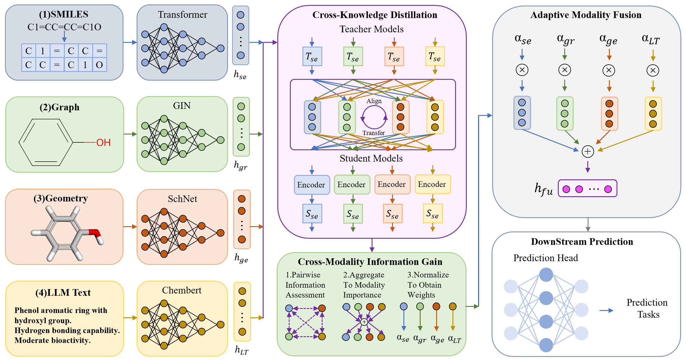

# MKD: Multimodal Knowledge Distillation For Molecular Property Prediction



MKD is a multimodal teacher-student framework that integrates SMILES, molecular graphs, 3D geometry, and LLM text through cross-knowledge distillation.

## 1. Dataset

We provide a compact LLM text dataset:

```text
dataset/data_100k_with_llm_text.csv
```

Other required PCQM4Mv2 resources, should be obtained from the OGB official documentation: https://ogb.stanford.edu/docs/lsc/pcqm4mv2/

## 2. Pretraining

Run 1D + 2D + 3D + LLM Text pretraining:

```bash
python scripts/run_experiment.py ^
  --config configs/pcqm4mv2_1d2d3d_text.yaml ^
  --one-d-path dataset/data_100k_with_llm_text.csv ^
  --graph-path pcqm4mv2 ^
  --geometry-path path/to/pcqm4m-v2-train.sdf ^
  --llm-text-path dataset/data_100k_with_llm_text.csv
```

Run teacher-only pretraining:

```bash
python scripts/train_teachers.py --config configs/pcqm4mv2_1d2d_text.yaml
```

Run student-only pretraining after teacher checkpoints are available:

```bash
python scripts/train_mkd.py --config configs/pcqm4mv2_1d2d_text.yaml
```
