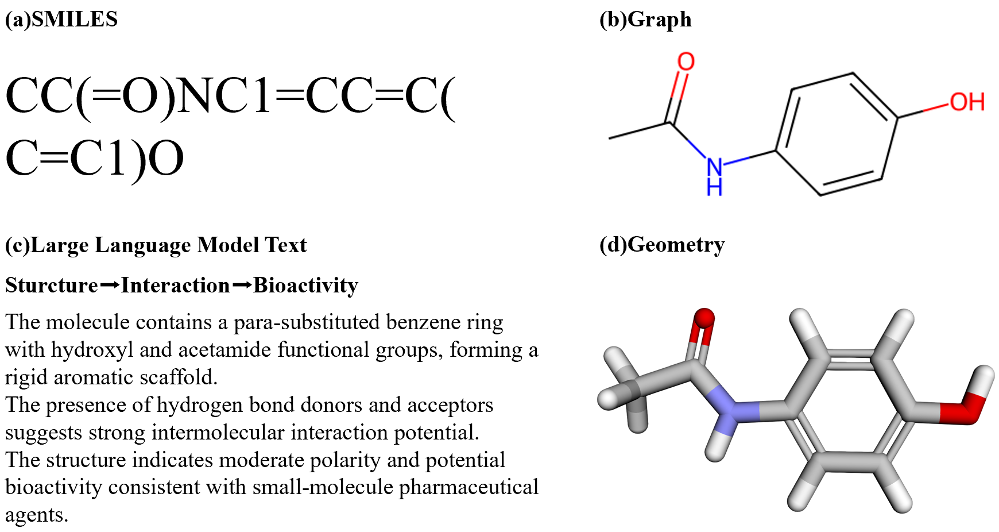

# MKD: Multimodal Knowledge Distillation For Molecular Property Prediction

**MKD** is a multimodal molecular property prediction framework based on **Multimodal Knowledge Distillation**.

Multimodal molecular representation learning has shown promising potential for molecular property prediction, but existing methods often suffer from modality utilization imbalance and insufficient fusion of heterogeneous information. To address this issue, we propose a unified multimodal knowledge distillation framework (MKD) for molecular property prediction.

We integrate **SMILES**, **molecular graph**, **3D geometry**, and **LLM-generated molecular text** to construct more comprehensive molecular representations. To enable effective multimodal learning, MKD introduces a cross-knowledge distillation mechanism for representation alignment and knowledge transfer across modalities, together with adaptive fusion modeling to dynamically adjust modality contributions. Experimental results show that the method achieves competitive performance, and further analysis indicates more balanced utilization of different modalities.


## Overview

The intended workflow is:

1. Configure the Python environment.
2. Provide dataset file paths for available molecular modalities.
3. Train available unimodal teachers.
4. Train the multimodal student through cross-knowledge distillation and adaptive fusion.

The current implementation supports:

- **1D SMILES teacher**: Transformer
- **2D graph teacher**: PCQM4Mv2/OGB-style graph conversion + GIN
- **3D geometry teacher**: SDF conformers + SchNet
- **LLM Text teacher**: molecular description text + ChemBERTa
- **Student**: available modalities + CKD + CMIG + adaptive fusion

## Modality Example

The repository includes a tiny data example based on the molecule `CC(=O)NC1=CC=C(C=C1)O`.



The example files are:

```text
data/example/data.csv
data/example/llm_text.csv
```

## 1. Environment

Create the recommended conda environment:

```bash
conda env create -f environment.yml
conda activate mkd-mpp
```

Or install with pip:

```bash
pip install -e .
```

For real 2D/3D training, make sure these packages are available:

- `torch`
- `torch-geometric`
- `ogb`
- `rdkit`
- `numpy`
- `pandas`
- `pyyaml`
- `tqdm`
- `transformers`
- `tokenizers`

## 2. Dataset Files

The project does not download or modify datasets automatically. You provide paths in the config or command line.

### Packaged Local Files

The release zip can include one compact local CSV file for convenience:

```text
dataset/data_100k_with_llm_text.csv
```

- `dataset/data_100k_with_llm_text.csv` is a compact 100K PCQM4Mv2-style subset with SMILES, target values, and an attached `llm_text` description column for the LLM Text modality.

The full original PCQM4Mv2 1D data should be obtained from the official OGB source rather than committed to this repository. Dataset paths can be supplied through config files or command-line arguments.

For official PCQM4Mv2 details, see the OGB documentation: https://ogb.stanford.edu/docs/lsc/pcqm4mv2/. The official page explains the original 1D SMILES/target data, 2D graph construction from SMILES, the `smiles2graph` utility, the graph dictionary format, the official split, and the downloadable 3D SDF conformer file.

### 1D CSV

Required. It must contain at least:

```csv
idx,smiles,homolumogap
0,O=C1...,3.0476
1,COc1...,4.4109
```

Default columns:

- `idx`: molecule index, used for official PCQM4Mv2 split, SDF alignment, and LLM text alignment.
- `smiles`: SMILES string.
- `homolumogap`: regression label.

### 2D Graph

Use:

```bash
--graph-path pcqm4mv2
```

This enables official PCQM4Mv2/OGB-style conversion from SMILES to graph dictionaries through `src/mkd_mpp/pcqm4mv2.py`. No graph file is written.

### 3D Geometry

Provide a full PCQM4Mv2 SDF file:

```bash
--geometry-path path/to/pcqm4m-v2-train.sdf
```

The CSV `idx` is assumed to match the SDF molecule order exactly. The loader builds a lightweight `.idx.pkl` cache next to the SDF file for lazy random access.

The cache file is named after the SDF, for example:

```text
pcqm4m-v2-train.sdf.idx.pkl
```

It stores molecule byte offsets only. Delete it if the SDF file changes.

### LLM Text

Provide a separate CSV with `idx` and `llm_text`:

```csv
idx,llm_text
0,This molecule has canonical SMILES...
1,This molecule contains...
```

The LLM text file must align with the main CSV by `idx`.

- If alignment is inconsistent, training raises an error.
- If some selected samples lack text and `skip_missing_llm_text: true`, those samples are skipped.

## 3. Configs

Main configs:

```text
configs/smoke.yaml
configs/pcqm4mv2_1d2d_text.yaml
configs/pcqm4mv2_1d2d3d_text.yaml
configs/pcqm4mv2_100k.yaml
configs/pcqm4mv2_full.yaml
```

Important fields:

```yaml
data:
  one_d_path: dataset/data_100k.csv
  graph_path: pcqm4mv2
  geometry_path:
  llm_text_path: dataset/llm_text.csv
  smiles_column: smiles
  label_column: homolumogap
  text_column: llm_text
  task_type: regression
  split_method: official_pcqm4mv2
  split_root: dataset
```

If a modality path is omitted, that modality is not trained and is not sent to its teacher or student branch.

The default LLM Text encoder uses ChemBERTa through HuggingFace:

```yaml
model:
  text:
    encoder_type: chemberta
    pretrained_model_name: DeepChem/ChemBERTa-77M-MTR
    freeze_encoder: true
    use_safetensors: true
    pooling: cls
    max_length: 256
```

The first run downloads the model weights into the local HuggingFace cache. After that, the cached model can be reused.

To create a compact PCQM4Mv2 subset while preserving the official 90/2/4/4 split ratio:

```bash
python scripts/create_pcqm4mv2_subset.py ^
  --input-csv dataset/data.csv ^
  --output-csv dataset/data_100k.csv ^
  --split-root dataset ^
  --sample-size 100000
```

## 4. Official Split

The project follows the official PCQM4Mv2 split method:

```python
split_dict = dataset.get_idx_split()
train_idx = split_dict["train"]
valid_idx = split_dict["valid"]
testdev_idx = split_dict["test-dev"]
testchallenge_idx = split_dict["test-challenge"]
```

For training and early stopping, the project uses:

- `train`
- `valid`

For this repository, validation is used to select checkpoints by training loss. The core pipeline focuses on demonstrating the multimodal teacher-student framework instead of maintaining a benchmark suite.

## 5. Run Training

Run the tiny example pipeline:

```bash
python scripts/run_experiment.py --config configs/smoke.yaml
```

Run the PCQM4Mv2 teacher + student pipeline:

```bash
python scripts/run_experiment.py --config configs/pcqm4mv2_1d2d_text.yaml
```

Override modality paths from the command line:

```bash
python scripts/run_experiment.py ^
  --config configs/pcqm4mv2_1d2d_text.yaml ^
  --one-d-path dataset/data_100k.csv ^
  --graph-path pcqm4mv2 ^
  --llm-text-path dataset/llm_text.csv
```

With 3D SDF:

```bash
python scripts/run_experiment.py ^
  --config configs/pcqm4mv2_1d2d3d_text.yaml ^
  --one-d-path dataset/data.csv ^
  --graph-path pcqm4mv2 ^
  --geometry-path path/to/pcqm4m-v2-train.sdf ^
  --llm-text-path path/to/llm_text.csv
```

## 6. Checkpoints And Outputs

Teacher checkpoints:

```text
checkpoints/.../smiles_teacher.pt
checkpoints/.../graph_teacher.pt
checkpoints/.../geometry_teacher.pt
checkpoints/.../llm_text_teacher.pt
checkpoints/.../mkd_student.pt
```

Last-epoch checkpoints are also written for recovery or inspection:

```text
checkpoints/.../*_teacher_last.pt
checkpoints/.../mkd_student_last.pt
```

Outputs:

```text
outputs/.../resolved_config.json
outputs/.../results.json
outputs/.../train_log.jsonl
outputs/.../student_valid_loss.json
```

Student training requires teacher checkpoints for every active modality when:

```yaml
require_teacher_checkpoints: true
```

## 7. Separate Teacher Or Student Training

Train teachers only:

```bash
python scripts/train_teachers.py --config configs/pcqm4mv2_1d2d_text.yaml
```

Train student only after teacher checkpoints exist:

```bash
python scripts/train_mkd.py --config configs/pcqm4mv2_1d2d_text.yaml
```

## 8. What To Provide For A New Dataset

At minimum:

- A CSV with `idx`, `smiles`, and target label.

Optional:

- `--graph-path pcqm4mv2` for 2D graph training.
- A full SDF file for 3D SchNet training.
- A separate `idx,llm_text` CSV for semantic text training.

The project trains only the modalities whose inputs are provided.
